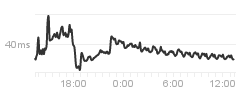

# Advanced Examples

## Sparklines

[According to Wikipedia](https://en.wikipedia.org/wiki/Sparkline):

> A sparkline is a very small line chart, typically drawn without axes or
> coordinates. It presents the general shape of the variation (typically over
> time) in some measurement, such as temperature or stock market price, in a
> simple and highly condensed way.

What can sparklines be used for? One example can be status dashboards for your
server park. Over at [status.github.com](https://status.github.com), you can see
charts that, in a sense, resemble sparklines:



Imagine if you have 100s of servers instead. Comparing bigger charts with
eachother is hard, and putting all the series in the same is just going to
create a mess. If you use sparklines instead, you could potentially make it
easier to compare them.

It is possible to create sparklines in clj-xchart, but it requires some styling
changes to get rid of the default options. In addition, I feel the line width
and marker size is too big for smaller charts, so I shrink it.

I like to emphasise where the current value is with a marker, so I also include
that in the plot. You can remove that if you don't like it.

```clj
(let [ys (repeatedly 100 #(* (- 0.5 (rand)) (rand)))]
  (c/spit
   (c/xy-chart {"line" {:x (range 100)
                        :y ys
                        :style {:marker-type :none
                                :line-color :green
                                :line-width 0.5}}
                "marker" {:x [99]
                          :y [(last ys)]
                          :style {:marker-color :magenta
                                  :marker-style :diamond}}}
               {:width 150
                :height 24
                :marker {:size 3}
                :legend {:visible? false}
                :axis {:ticks {:visible? false}}
                :chart {:padding 0}
                :plot {:margin 0
                       :border-visible? false
                       :background-color :black
                       :grid-lines {:visible? false
                                    :content-size 1.0}}})
   "sparkline.png"))
```

The code above creates a sparkline which looks like this:
. If you prefer a more
terminal-like colour scheme, you can replace the line's `:line-color` with
`:green`, the marker's `:marker-color` to `:magenta` and the plot's
`:background-color` to `:black`. This will make the sparkline look like this:
.
