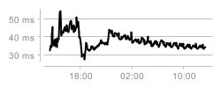

# Advanced Examples

## Sparklines

[According to Wikipedia](https://en.wikipedia.org/wiki/Sparkline):

> A sparkline is a very small line chart, typically drawn without axes or
> coordinates. It presents the general shape of the variation (typically over
> time) in some measurement, such as temperature or stock market price, in a
> simple and highly condensed way.

What can sparklines be used for? One example can be status dashboards for your
server park. Over at [status.github.com](https://status.github.com), you can see
charts that, in a sense, resemble sparklines:


Imagine if you have 100s of servers instead. Comparing bigger charts with
eachother is hard, and putting all the series in the same is just going to
create a mess. If you use sparklines instead, you could potentially make it
easier to compare them.

It is possible to create sparklines in clj-xchart, but it requires some styling
changes to get rid of the default options. In addition, I feel the line width
and marker size is too big for smaller charts, so I shrink it.

I like to emphasise where the current value is with a marker, so I also include
that in the plot. You can remove that if you don't like it.

```clj
(let [ys (repeatedly 100 #(* (- 0.5 (rand)) (rand)))]
  (c/spit
   (c/xy-chart {"line" {:x (range 100)
                        :y ys
                        :style {:marker-type :none
                                :line-color :black
                                :line-width 0.5}}
                "marker" {:x [99]
                          :y [(last ys)]
                          :style {:marker-color :red
                                  :marker-style :diamond}}}
               {:width 150
                :height 24
                :marker {:size 3}
                :legend {:visible? false}
                :axis {:ticks {:visible? false}}
                :chart {:padding 0}
                :plot {:margin 0
                       :border-visible? false
                       :background-color :white
                       :grid-lines {:visible? false
                                    :content-size 1.0}}})
   "sparkline.png"))
```

The code above creates a sparkline which looks like this:
. If you prefer a more
terminal-like colour scheme, you can replace the line's `:line-color` with
`:green`, the marker's `:marker-color` to `:magenta` and the plot's
`:background-color` to `:black`. This will make the sparkline look like this:
.

## GitHub System Status

Speaking of the GitHub system status, it would be interesting to see how close
we can get to their style. GitHub uses D3 to visualise their status pages, but
since the result is noninteractive, there is no reason (except for server
performance) we couldn't use something like clj-xchart to render those pages.

If you'd like to render this yourself, head over to the
[GitHub System Status](https://status.github.com/) and look at the source. In
it, there should be some divs with a `data-string` attribute which just a JSON
array of values (For example: `[[1477049100.0, 32.40260003567365],
[1477049400.0, 35.22429803658118] ...]`). This is actually valid Clojure as
well, so you can copypaste one of those and do

```clj
(def data ... ) ;; your long array of data here
```

to follow along with the example provided.

The data from GitHub is number of seconds since "the epoch" (January 1, 1970,
00:00:00 GMT), along with the value detected at that time. We can convert the
second value into a date by multiplying it with 1000 and pass it to
java.util.Date:

```clj
(import '(java.util Date))

;; in the xy-chart series generation:
(c/extract-series
 {:x (comp #(Date. (* 1000 %)) long first)
  :y second}
 data)
```

We need to change the font size to something smaller, and this can be done by
using the Java font class. Through experimentation, I found that the following
font worked well:

```clj
(import '(java.awt Font))

(def small-plain (Font. Font/SANS_SERIF Font/PLAIN 10))
```

Additionally, the default grid lines are dashed, and we'd like to have them
solid. We could use `:solid` here, but that makes the grid lines too big, and
there's no option to set the grid line size, so for me it seemed the easiest to
just make a BasicStroke and pass it ourselves:

```clj
(import '(java.awt BasicStroke))

(def small-stroke (BasicStroke. 0.2))
```

Using the `:light-gray` color seems to work fine for everything except the font,
which turns extremely light. To remedy this, we take the light gray color from
the clj-xchart's color map and utilise the
[`.darker`](https://docs.oracle.com/javase/7/docs/api/java/awt/Color.html#darker\(\))
method

```clj
(def font-color (.darker (c/colors :light-gray)))
```

Combining all of this together results in the following piece of code:

```clj
(import '(java.util Date)
        '(java.awt Font BasicStroke))

(def small-plain (Font. Font/SANS_SERIF Font/PLAIN 10))

(def small-stroke (BasicStroke. 0.2))

(def font-color (.darker (c/colors :light-gray)))

(c/spit
 (c/xy-chart {"line" (merge
                      (c/extract-series
                       {:x (comp #(Date. (* 1000 %)) long first)
                        :y second}
                       data)
                      {:style {:marker-type :none
                               :line-color :black}})}
             {:width 250
              :height 100
              :legend {:visible? false}
              :chart {:background-color :white}
              :axis {:ticks {:labels {:color font-color
                                      :font small-plain}
                             :marks {:color :light-gray}}}
              :y-axis {:decimal-pattern "## ms"}
              :x-axis {:tick-mark-spacing-hint 1}
              :date-pattern "HH:mm"
              :plot {:border-visible? false
                     :grid-lines {:vertical? false
                                  :horizontal? true
                                  :color :light-gray
                                  :stroke small-stroke}}})
 "gh-status.png")
```

The result is comparable, but not identical. Left is original, right is the one
emitted by the code above:

 

There are some things you cannot do easily with XChart/clj-xchart, and the big
bad one here is tick marks: You can attempt to control it by setting
`:tick-mark-spacing-hint` on either the `:y-axis` or the `:x-axis`, but they are
just hints, and in this case, it will either remove all the tick marks or
display the ones shown here.

The other "issue" is that you cannot remove the y-axis tick mark line without
also removing the x-axis tick mark line: You can remove both via
`[:axis :ticks :line-visible?]`, but not just one.
