# Render Options

XChart ships with roughly a million different options, and clj-xchart attempts
to do the same. However, instead of performing mutable modifications on the
chart itself, you pass in a map of styling values in clj-xchart.

There will be a lot of examples below this big chunk which references most of
the options. Feel free to skip it (it looks rather scary if you just want to
tweak one or two styles), but if you find something you wonder about, it may be
valuable to get back up here and look at the complete reference again.

To follow the examples, you can either use
[lein-try](https://github.com/rkneufeld/lein-try):

```shell
$ lein try com.hypirion/clj-xchart
```

or [inlein](http://inlein.org/):

```clj
#!/usr/bin/env inlein

'{:dependencies [[org.clojure/clojure "1.8.0"]
                 [com.hypirion/clj-xchart "0.2.0"]]}

(require '[com.hypirion.clj-xchart :as c])

;; your code here
```

The code below assumes that the namespace `com.hypirion.clj-xchart` is required
and aliased to `c`, either like in the inlein example above, or in a `ns` form.
Apart from that, one should be able to copypaste the code to get the
visualisation up.

## Style Map

All charts support the following styles:

```clj
{:width "Width of chart in pixels (default: 640)"
 :height "Height of chart in pixels (default: 500)"
 :title "Title of the chart, written above the chart itself"
 :theme "Styling theme for this chart"
 :render-style "Chart-specific rendering style."
 :annotations-font "Font for annotations"
 :annotations? "Boolean, whether or not to view annotations"
 :chart {:background-color "The background color of the chart"
         :font-color "The color of the font in this chart"
         :padding "The chart padding in ints"
         :title {:box {:background-color "Background color for the title box"
                       :border-color "Border color for the title box"
                       :visible? "Whether or not to show the title box"}
                 :font "Font of the title"
                 :padding "The chart title padding"
                 :visible? "Whether or not to show a title"}}
 :legend {:background-color "The background color of the legend"
          :border-color "The border color of the legend"
          :font "The font of the series names within the legend"
          :padding "Legend padding"
          :position "The position of the legend. By default :outside-e"
          :series-line-length "The length of the series line, if applicable"
          :visible? "Whether the legend is visible or not"}
 :plot {:background-color "The background color for the plot"
        :border-color "The border color for the plot"
        :border-visible? "Whether or not to show the plot border"
        :content-size "The content size of the plot inside the plot area of the
                       chart. Must be between 0.0 and 1.0"}
 :series [{:color "Color of the nth series. Can be overwritten if the series
                   itself contains color styling information."
           :stroke "Sets the line stroke for the nth series. Can be overwritten
                    if the series itself contains line stroke information."
           :marker "Sets the marker for the nth series. Can be overwritten
                    if the series itself contains marker information."}]}
```

Wherever you can specify a color, you must use a java.awt.Color. For
convenience, you can also use the following keywords which represent their
respective color:

```clj
#{:blue :black :cyan :dark-gray :gray :grey :green :light-gray
  :magenta :orange :pink :red :white :yellow}
```

There are also predefined BasicStrokes available, which you can use if you do
not prefer to use your own:

```clj
#{:none :solid :dash-dash :dash-dot :dot-dot}
```

Wherever you set a marker, you could make your own by subclassing
`org.knowm.xchart.style.markers.Marker`. That is a lot of effort though, so it's
probably easier to just use the ones shipped with xchart. Here they are:

```clj
#{:circle :diamond :none :square :triangle-up :triangle-down}
```

For text alignments, only the following options can be used:

```clj
#{:centre :left :right}
```

Legends can be placed at different positions. Here are all the possible
locations you can place them:

```clj
#{:inside-n :inside-ne :inside-nw :inside-se :inside-sw :outside-e}
```

Note that, although `:inside-n` is available, `:inside-s` isn't. I'd recommend
to look up the options here or try it out before blindly shipping a different
legend position to production.

By default, the legend is placed `:outside-e`.

Finally, themes. You can make your own theme (Which will not be discussed here,
go to XChart's documentation if you're interested) or use the themes bundled
with XChart by default:

```clj
#{:ggplot2 :matlab :xchart}
```

The `:xchart` option is chosen by default.

### Axes Styles

All the chart types except the pie chart also supports styling of the axes. The
styling is as such:

```clj
{:axis {:ticks {:labels {:color "The color of tick labels"
                         :font "The font of tick labels"}
                :marks {:length "Length of axis tick marks"
                        :color "The color of axis tick marks"
                        :stroke "The stroke for tick marks"
                        :visible? "Whether or not to render tick marks"}
                :padding  "The axis tick padding"
                :visible? "Whether or not to render axis ticks"
                :line-visible? "The visibility of the line parallel to the plot
                                edges that go along with the tick marks"}
        :title {:font "The axis title font to use"
                :visible? "Whether or not to render the title"
                :padding "The axis title padding"}}
 :plot {:grid-lines {:horizontal? "Whether or not to plot horizontal grid lines"
                     :vertical? "Whether or not to plot vertical grid lines"
                     :visible? "Whether or not to plot grid lines"
                     :color "The color of the grid lines"
                     :stroke "The stroke of grid lines (type: java.awt.Stroke)"}
        :margin "The plot margin"
        :tick-marks? "Whether or not to show ticks marks"}
 :error-bars-color "Color of the error bars"
 :date-pattern "The string date pattern"
 :decimal-pattern "The string decimal pattern"
 :locale "The locale to use (type: java.util.Locale)"
 :marker {:size "The size of markers"}
 :timezone "The timezone this chart will be rendered for"
 :x-axis "Identical to y-axis: See below"
 :y-axis {:label {:alignment "Text alignment of the axis title"
                  :rotation "Set rotation of the x-axis in integers
                             (Not available for the y-axis)"}
          :logarithmic? "Whether or not to set this axis logarithmic or not.
                         By default false"
          :max "Sets the maximal value for this axis"
          :min "Sets the minimal value for this axis"
          :decimal-pattern "Sets the decimal pattern for this axis"
          :tick-mark-spacing-hint "The spacing between tick marks for this axis"
          :ticks-visible? "Whether or not to show ticks for this axis"
          :title-visible? "Whether or not to show title for this axis"}}
```

Again, don't be too afraid, there will be examples below.

## General Purpose examples

Before we start off with chart-specific options, it would be nice to show some
of the million options. We will do so here.

The typical values you should always provide is `:width`, `:height`, `:title`,
`[:x-axis :title]` and `[:y-axis :title]`. Fortunately those should be
self-describing, and if not, the examples below should help you with usage.

### Themes

One easy way to tweak the style of the chart easily is via the `:theme` option.
You can use one of `:ggplot2` `:matlab` or `:xchart` for this:

```clj
(require '[com.hypirion.clj-xchart :as c])

(defn chart [theme]
  (c/xy-chart
   {"One" {:x (range 10)
           :y (range 10)}
    "Two" {:x (range 10)
           :y (range 10 20)}
    "Three" {:x (range 10)
             :y (range 20 10 -1)
             :error-bars (take 10 (iterate #(+ % 0.3) 0.0))}}
   {:width 640
    :height 500
    :title "Sample chart"
    :x-axis {:title "The x-axis title"}
    :y-axis {:title "The y-axis title"}
    :theme theme}))

(c/view (chart :ggplot2) (chart :matlab) (chart :xchart))
```

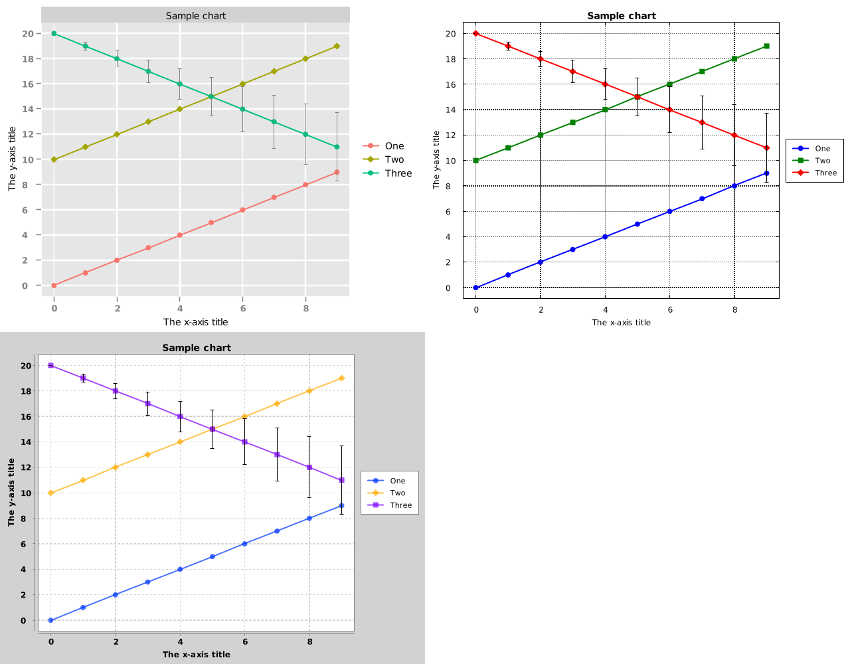

### Logarithmic Scale

Sometimes, you end up with y- or x-axes which grow exponentially. When you do,
it's convenient to scale the chart logarithmically instead of linearly. This is
possible by setting `[:x/y-axis :logarithmic?]` to true:


```clj
(c/view (c/xy-chart
         {"Paying customers" {:x (range 2007 2017)
                              :y [0.5 1 1.3 1.9 3 6 16 34 60 125]}}
         {:width 640
          :height 500
          :title "Number of StrexCorp Customers"
          :x-axis {:title "Year"
                   :decimal-pattern "####"}
          :y-axis {:title "Users in millions"
                   :logarithmic? true}}))
```

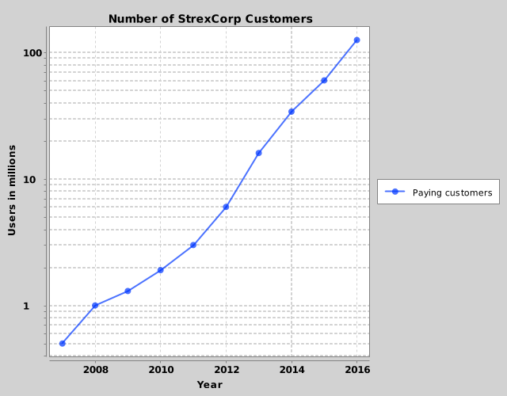

Here you can also see the usage of `:decimal-pattern`, it is used to ensure we
don't print ".0" after the year. See the documentation of
[java.text.DecimalFormat](https://docs.oracle.com/javase/7/docs/api/java/text/DecimalFormat.html)
for the complete decimal pattern specification.

### Legend Positions

The legend often end up being so wide that it shrinks the plot area
significantly. That's inconvenient, and to avoid that we can set
`[:legend :position]`:

```clj
(c/view (c/pie-chart
         [["Apples" 1230]
          ["Oranges" 1523]]
         {:width 640
          :height 500
          :title "Apples and Oranges"
          :legend {:position :inside-ne}
          :series [{:color :red} {:color :orange}]}))
```

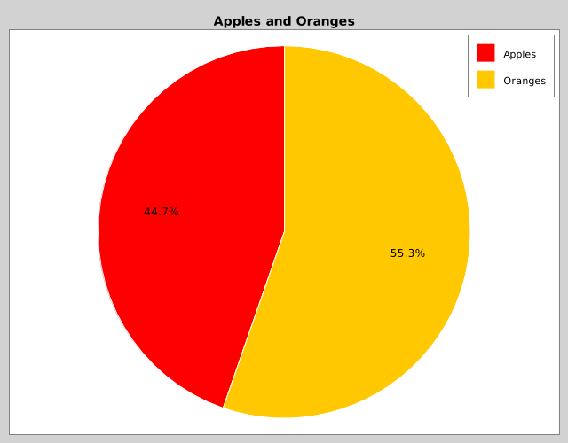

Here we also use `:series` to set the color of the series. For bubble charts,
there are no "verbose" form yet, and thus the ordering matters for `:series`.
(It's on the list of things to fix)

Sometimes it's obvious from the context what the line(s) represent. In that
case, we can omit the legend. We can also omit the axis titles if it's obvious
what we represent:

```clj
(import 'java.util.GregorianCalendar)

(defn months [year]
  (map (fn [month]
         (let [c (GregorianCalendar.)]
           (.set c year month 23)
           (.getTime c)))
       (range 12)))

(c/view (c/xy-chart
         {"Prediction of Outages" {:x (months 2017)
                                   :y (repeatedly 12 #(rand-int 3))}}
         {:width 640
          :height 500
          :title "Expected Outages in 2017"
          :date-pattern "MMM"
          :y-axis {:tick-mark-spacing-hint 200}
          :legend {:visible? false}}))
```

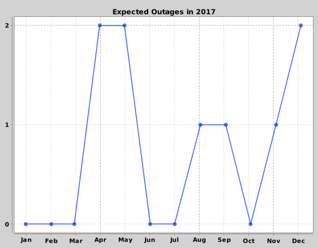

Here I also tweaked the x axis pattern to only show months. See the
documentation for
[SimpleDateFormat](https://docs.oracle.com/javase/7/docs/api/java/text/SimpleDateFormat.html)
to see how one can tune this value.

Additionally, I felt there were too many y-axis ticks. Some represented decimal
values, and in this case I'd just prefer to show integers. You can attempt to
tweak this by changing the value of `[:y-axis :tick-mark-spacing-hint]`, but
this is hard to do automatically. Unfortunately that's the only option to tweak
as of now, and it's not easy to work with.

### Colors and Markers

We can use colors and markers to tweak the style of values:

```clj
(import 'java.util.GregorianCalendar)

(defn months [year]
  (map (fn [month]
         (let [c (GregorianCalendar.)]
           (.set c year month 23)
           (.getTime c)))
       (range 12)))

(c/view (c/xy-chart
         {"Wins" {:x (months 2015)
                  :y [0 2 3 3 4 7 7 8 8 7 7 5]
                  :style {:marker-type :triangle-up
                          :marker-color :black
                          :line-color :green}}
          "Losses" {:x (months 2015)
                    :y [3 2 2 0 2 4 3 1 3 4 2 0]
                    :style {:marker-type :triangle-down
                            :marker-color :black
                            :line-color :red}}}
         {:width 640
          :height 500
          :title "Wins and Losses in 2015"}))
```

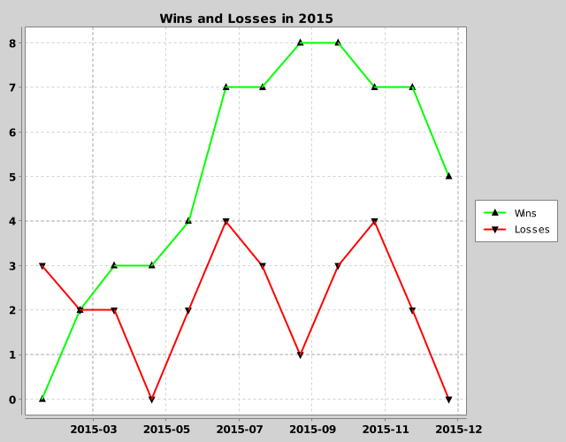

It's preferable to keep this on the input themselves if possible, as the
`:series` styler depends on ordering.

The error bar color has an additional option, which is to match the series
color. This can be done by setting the error bars color to `:match-series`:

```clj
(c/view (c/xy-chart
         {"Volatility" {:x (range 10)
                        :y (range 10)
                        :error-bars [0 2.0 1.3 4.5 0.21 5.6 3.1 2.8 2.1 1.8]}
          "Volatility 2" {:x (range 10)
                          :y (range 3 13)
                          :error-bars [0 1.0 2.2 0.5 3.1 6.0 1.2 3.1 1.1 0.3]}}
         {:width 640
          :height 500
          :title "Volatility"
          :error-bars-color :match-series
          :legend {:position :inside-nw}}))
```

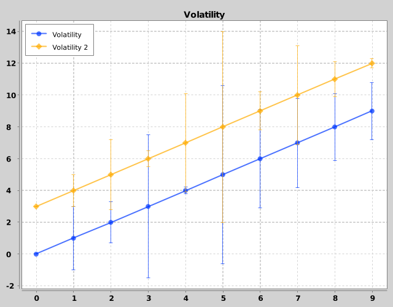

### Strokes

You can also set the stroke type on each chart type:

```clj
(import 'java.awt.BasicStroke)

(def my-dashed
  (BasicStroke. 1.0 BasicStroke/CAP_BUTT BasicStroke/JOIN_MITER
                10.0 (float-array [10.0]) 0.0))

(c/view (c/xy-chart
         {"Optimistic" {:x (range 10)
                        :y [0 3 6 6 9 9 10 10 9 10]
                        :style {:line-style :dot-dot}}
          "Conservative" {:x (range 10)
                          :y [0 0 3 1 2 3 6 5 4 2]
                          :style {:line-style my-dashed}}}
         {:width 640
          :height 500
          :title "Trend Estimates"
          :legend {:position :inside-nw}}))
```

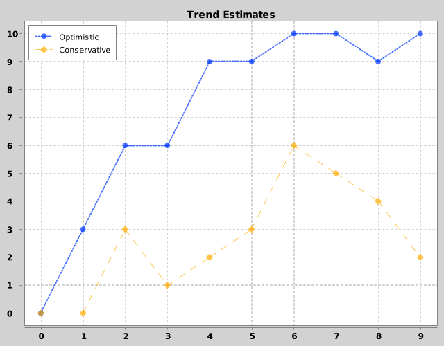

Usually the default styles work fine, but you can also make your own strokes
like in the example above.

## XY Chart Examples

Now we can finally go over to specific chart examples.

The generic examples above should cover almost everything specific with XY
charts. There is an additional option – `:render-style` – which changes how the
xy-lines are rendered. The style can be only one of the following ones:

```clj
#{:line :area :scatter}
```

### Area Chart

By default `:line` is used. You can specify `:render-style` for the entire graph
or on a per-series basis. The style defined on a specific series overrides the
default style. Here's an XY-chart which uses `:area` by default, but the "Total
memory" series overrides this via its own `:render-style`.

```clj
(c/view (c/xy-chart
         {"Memory usage" {:x (range 0 10 0.5)
                          :y [0.0 0.5 2.3 4.5 2.7 4.5 6.7 9.0 9.3 9.5
                              6.7 7.5 8.8 10.3 9.7 11.4 5.6 4.5 5.6 1.2]
                          :style {:marker-type :none}}
          "Total memory" {:x (range 10)
                          :y (repeat 10 12)
                          :style {:render-style :line
                                  :marker-type :none
                                  :line-color :red}}}
         {:width 640
          :height 500
          :title "Memory usage"
          :render-style :area
          :x-axis {:title "Time (min)"
                   :min 0
                   :max 10}
          :y-axis {:title "Memory (GB)"
                   :max 15}
          :legend {:position :inside-nw}}))
```

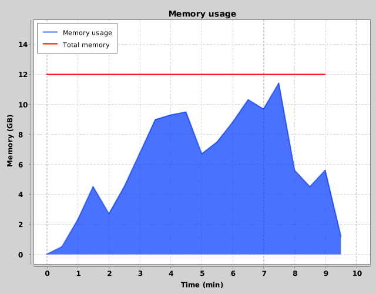

### Scatter Chart

If you do not want lines between points, you can use the render style
`:scatter`. This is typical for when you have data points and want to show the
relation between two variables in those points. Ordering does not matter for
scatter charts, so the data points can be in arbitrary order:

```clj
(def april-data
  [{:temperature 21.76, :income 732.69}
   {:temperature 23.19, :income 697.69}
   {:temperature 18.82, :income 571.86}
   {:temperature 23.03, :income 778.27}
   {:temperature 27.74, :income 755.72}
   {:temperature 24.01, :income 838.15}
   {:temperature 25.21, :income 663.07}
   {:temperature 15.77, :income 536.15}
   {:temperature 25.51, :income 937.94}
   {:temperature 20.84, :income 715.92}
   {:temperature 13.52, :income 379.37}
   {:temperature 17.32, :income 482.05}
   {:temperature 15.31, :income 470.40}
   {:temperature 26.17, :income 752.04}])

(c/view (c/xy-chart
         {"Sales" {:x (map :temperature april-data)
                   :y (map :income april-data)}}
         {:title "Sales for first half of April"
          :width 640
          :height 500
          :y-axis {:decimal-pattern "$ #,###.##"}
          :x-axis {:decimal-pattern "##.## °C"}
          :render-style :scatter}))
```

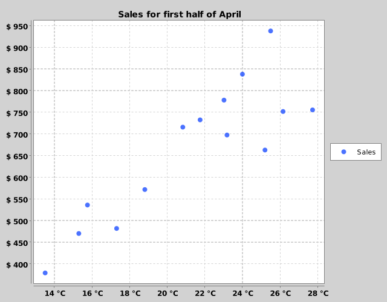

You can even use it for silly things like a map for a 2D game! I'm not sure I'd
recommend this as a rendering engine though.

```clj
(def monsters
  [{:x 4 :y 5}
   {:x 8 :y 0}
   {:x 1 :y 2}
   {:x 1 :y 1}
   {:x 0 :y 1}])

(def treasures
  [{:x 3 :y 7}
   {:x 5 :y 1}
   {:x 4 :y 7}])

(def player {:x 5 :y 5})

(c/view (c/xy-chart
         {"Monsters" {:x (map :x monsters)
                      :y (map :y monsters)
                      :style {:marker-color :red
                              :marker-type :diamond}}
          "Player" {:x [(:x player)]
                    :y [(:y player)]
                    :style {:marker-color :green
                            :marker-type :triangle-up}}
          "Treasures" {:x (map :x treasures)
                       :y (map :y treasures)
                       :style {:marker-color :orange
                               :marker-type :square}}}
         {:title "Map"
          :width 640
          :height 500
          :render-style :scatter
          :axis {:ticks {:visible? false}}}))
```

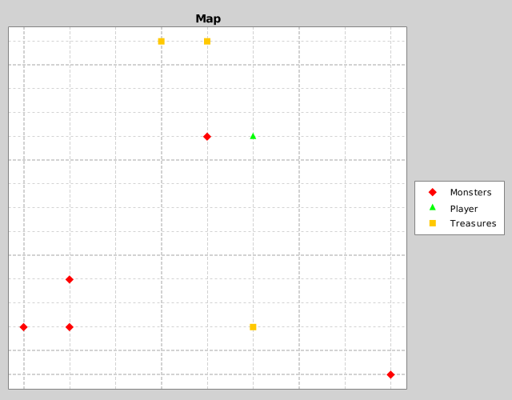

## Category Charts

I tend to group the render style of category charts into two groups:
"Categorical" and "XY-ish".

There are two categorical render-styles: `:bar` and `:stick`. They put the
series beside each other for each X axis value. For those, the `:series-order`
(As described in the [tutorial](tutorial.md)) matter for the visualisation:

```clj
(defn fruit-chart [style]
  (c/category-chart
   {"Bananas" {"Mon" 6, "Tue" 2, "Fri" 3, "Wed" 1, "Thur" 3}
    "Apples" {"Tue" 3, "Wed" 5, "Fri" 1, "Mon" 1}
    "Pears" {"Thur" 1, "Mon" 3, "Fri" 4, "Wed" 1}}
   {:title "Weekly Fruit Sales"
    :width 640
    :height 500
    :render-style style
    :x-axis {:order ["Mon" "Tue" "Wed" "Thur" "Fri"]}}))

(c/view (fruit-chart :bar) (fruit-chart :stick))
```

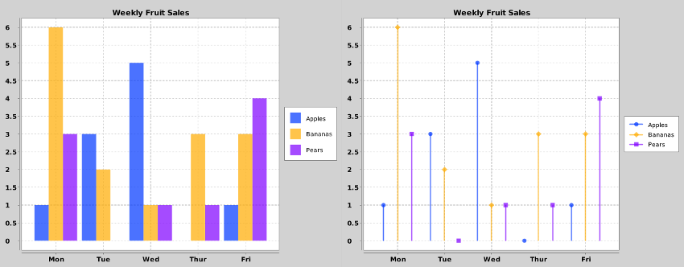

The "XY-ish" render styles are `:area`, `:line` and `:scatter`. I call them
"XY-ish" because they feel identical to the xy-chart. There are two notable
distinctions:

1. With the category chart, you can let the x-axis values be strings
2. The distance between the x-axis point will be fixed and not depend on the
   x-axis values themselves

```clj
(c/view (fruit-chart :area) (fruit-chart :line) (fruit-chart :scatter))
```

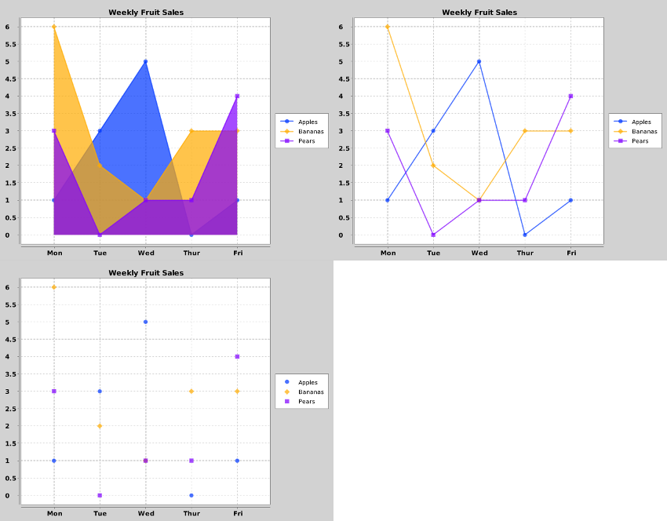

## Pie Charts

Pie charts can either be pie shaped or donut shaped:

```clj
(c/view (c/pie-chart {"A" 1/3 "B" 2/3})
        (c/pie-chart {"A" 1/3 "B" 2/3}
                     {:render-style :donut}))
```

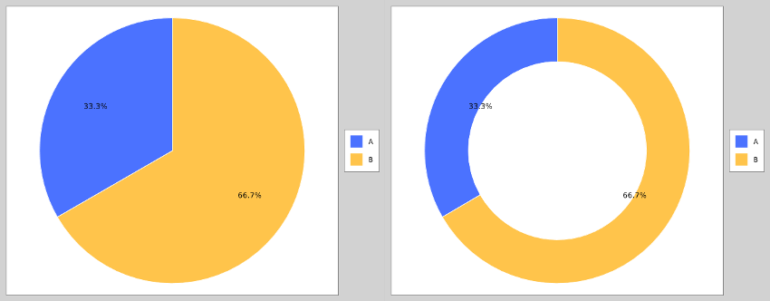

In my experience, the donut chart labels usually ends up on the border of the
inner donut edge, which looks bad. You can tune the annotation distance for both
styles through `:annotation-distance`. I find that an annotation distance
of 0.82 seems to be optimal for donut charts:

```clj
(c/view (c/pie-chart {"A" 1/3 "B" 2/3}
                     {:render-style :donut
                      :annotation-distance 0.82}))
```

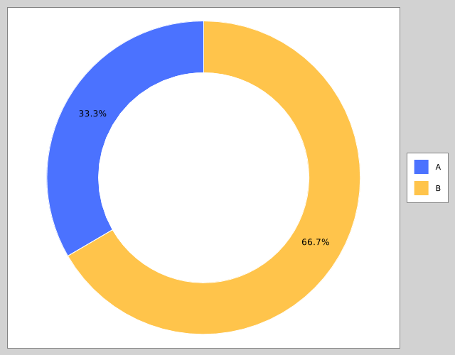

You can also tune the `:donut-thickness` if the rendering style is donut. It has
to be a number between 0 and 1.0 inclusive: 1.0 turns the donut into a pie
chart, whereas 0.0 will turn the donut into nothing.

If you for some reason would like to tune where the first chart element starts,
you can do so by setting `:start-angle` to a value (in degrees). In that case,
you should probably force the order of the elements as well to ensure correct
ordering:

```clj
(c/view
 (c/pie-chart [["Not Pacman" 1/4]
               ["Pacman" 3/4]]
              {:start-angle 225.0
               :plot {:background-color :black}
               :series [{:color :black} {:color :yellow}]}))
```


You can also specify different annotation types for your pie chart with
`:annotation-type`. It is by default `:percentage` as we've seen in the previous
examples, but we can also set it to `:label` or `:label-and-percentage`

```clj
(c/view (c/pie-chart {"A" 3 "B" 1}
                     {:annotation-type :label})
        (c/pie-chart {"A" 3 "B" 1}
                     {:annotation-type :label-and-percentage}))
```

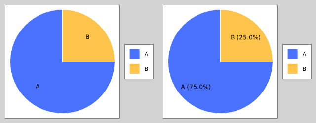

Sometimes, XChart will some labels for you if it finds out that the space for
the label isn't large enough. Sometimes you disagree with XChart, and when you
do, you can set the parameter `:draw-all-annotations?` to true.

Finally, if you for some reason doesn't want circular pie or donut charts, you
can set `:circular?` to `false`.
