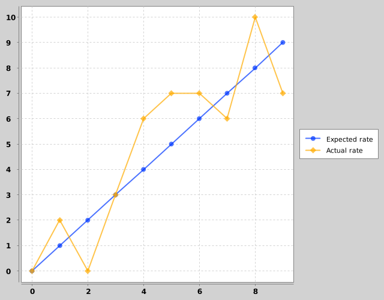
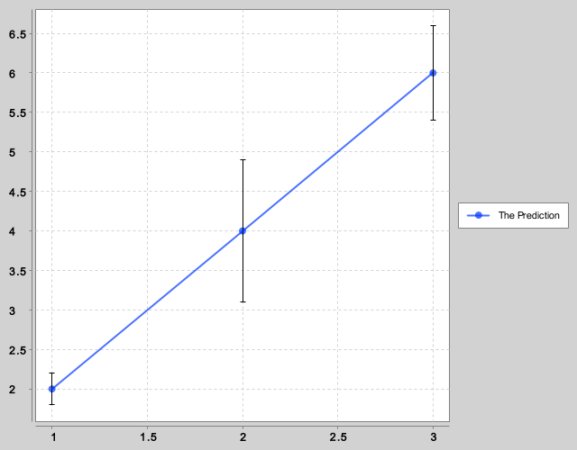
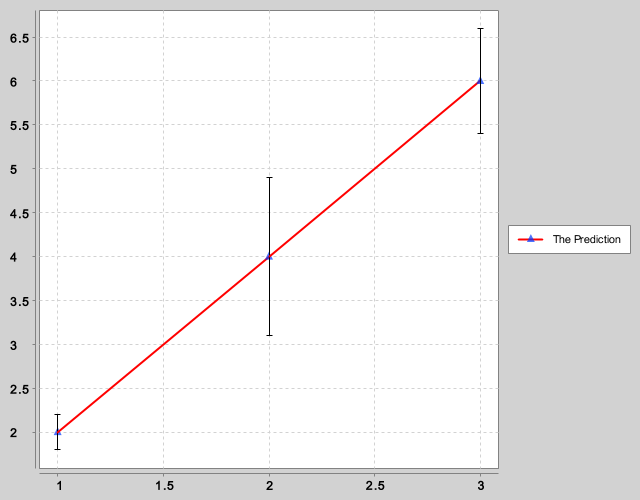
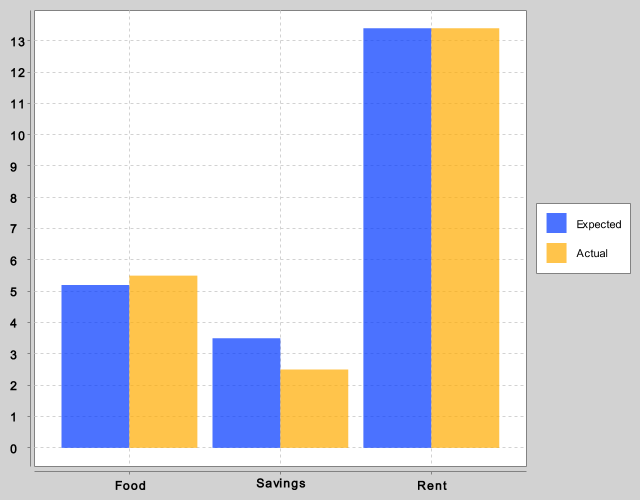
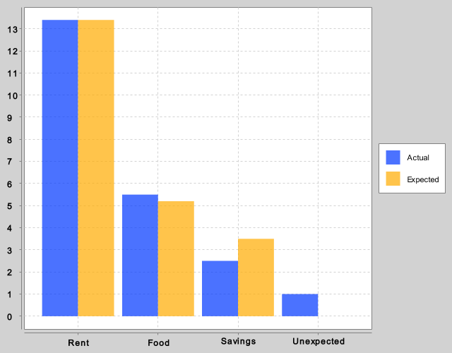
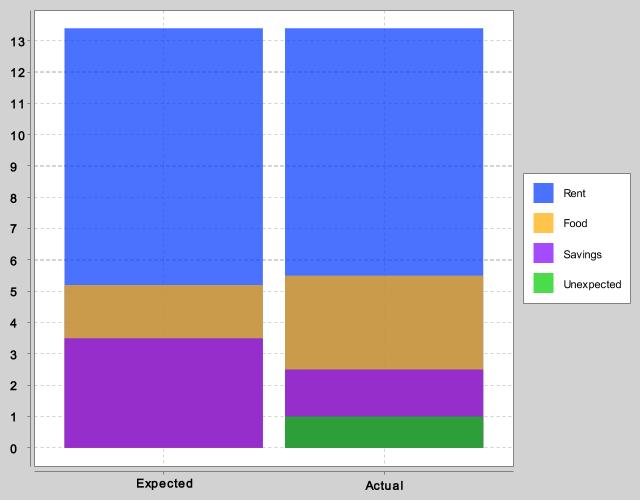
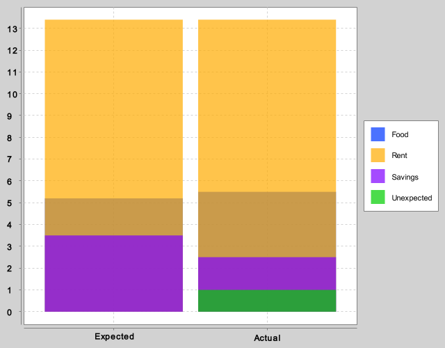
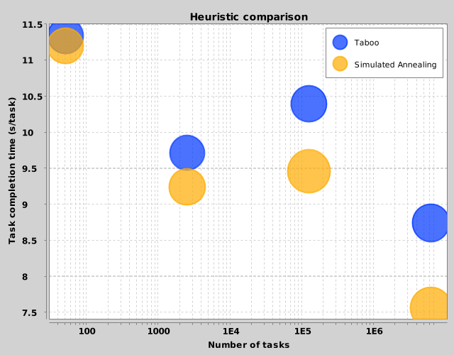
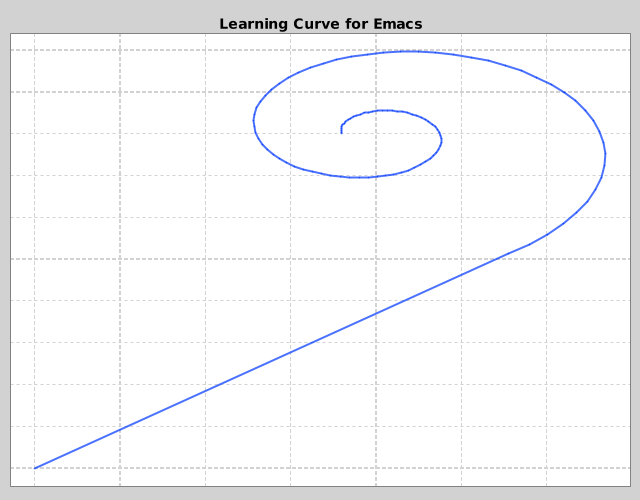

# Tutorial for clj-xchart

clj-xchart is a Clojure wrapper over the Java library
[XChart](http://knowm.org/open-source/xchart/), which is a lightweight library
for plotting data. If you feel Incanter is a bit too much for just plotting,
then this may be a potential candidate.

clj-xchart has a small set of functions, but roughly 1 million different render
style options. We'll skip those here, but feel free to look at the
[render-options](render-options.md) page if you want to know what you can and
cannot configure.

To play around with clj-xchart, you can either use
[lein-try](https://github.com/rkneufeld/lein-try):

```shell
$ lein try com.hypirion/clj-xchart
```

or [inlein](http://inlein.org/):

```clj
#!/usr/bin/env inlein

'{:dependencies [[org.clojure/clojure "1.8.0"]
                 [com.hypirion/clj-xchart "0.2.0"]]}

(require '[com.hypirion.clj-xchart :as c])

;; your code here
```

The code below assumes that the namespace `com.hypirion.clj-xchart` is required
and aliased to `c`, either like in the inlein example above, or in a `ns` form.

## Visualising

Before we go on, let's have a look at the different possible ways to save and
show a chart on the screen.

`view` takes one or more charts and renders in a swing frame. This is nice
when you're prototyping and need to verify that the chart looks right. Or you
can use it to compare the styling of two charts to figure out which one looks
the best.

`to-bytes` takes a single chart and a format type, and returns a byte array of
the output. The format type can be either `:png`, `:gif`, `:bmp`,
`:jpg`/`:jpeg`, `:pdf`, `:svg` and `:eps`.

`spit` is utility function and a chart variant of Clojure's own `spit`. It takes
a chart, a filename and an optional format type, and writes it to disk. If the
format type is not specified, then it is guessed by the filename extension.

For low-level use, you can use `as-buffered-image` to get a
`java.awt.image.BufferedImage` from the chart.

## XY-Charts

The most straightforward chart type is the XY-chart: It plots line plots. To
create a XY-chart, we use the `xy-chart` function:

```clj
user=> (def chart
         (c/xy-chart {"Expected rate" [(range 10) (range 10)]
                      "Actual rate" [(range 10) (map #(+ % (rand-int 5) -2) (range 10))]}))
#'user/chart

user=> (c/view chart)
```

This should show you something à la this:



All functions which creates charts start with the series they should contain.
The series is a map from strings to the content of the series – which depends on
what type of chart you want. For a simple xy-chart, this is a vector of 2 or 3
sequences of numbers. The first sequence is the x values, the second is the y
values, and the optional last one is the error bars.

```clj
user=> (def series {"The Prediction" [[1 2 3] ;; X
                                      [2 4 6] ;; Y
                                      [0.2 0.9 0.6]]}) ;; error-bars (optional)
#'user/series
user=> (def error-bars (c/xy-chart series))
#'user/error-bars
user=> (c/view error-bars)
```



The `view` function, which we've used two times already, is just a utility
function which renders the chart for you in a window. It is variadic: You can
view multiple charts in the same command if you want to compare them against
each other (I usually do this when I want to figure out which one looks best):

```clj
user=> (c/view chart error-bars)
```

### Verbose

All series values can also be on a "verbose" form. If we go back to the content
of the error-bars example:

```clj
{"The Prediction" [[1 2 3] ;; X
                   [2 4 6] ;; Y
                   [0.2 0.9 0.6]]})
```

Then the same data can be written like this:

```clj
{"The Prediction" {:x [1 2 3]
                   :y [2 4 6]
                   :error-bars [0.2 0.9 0.6]}}
```

These two forms are identical, but the latter is more self-describing. Use the
form which fits with how you extract your data.

One thing you can do with the "verbose" form which you cannot do with the vector
form is to attach styling:

```clj
{"The Prediction" {:x [1 2 3]
                   :y [2 4 6]
                   :error-bars [0.2 0.9 0.6]
                   :style {:marker-type :triangle-up
                           :line-color :red}}}
```

This will render as follows:



Note that you _can_ attach styling for the entire chart via
[render-options](render-options.md), and in some cases also attach a style based
on input ordering. What you should use depends on whether it makes sense to
bundle styling with data or not in your use case.

## Category Charts

You can also render category charts with clj-xchart: This is done via
`category-chart*`. The most famous type of category chart is probably the bar
chart, but other variants exist. One difference between between XY-charts and
category charts are their inputs: The X-axis of a category chart can either be
numbers, dates or strings, whereas the X-axis of an XY-chart can only be
numbers. Another difference is that the X-axis isn't "sorted", that is, if the
X-axis is `[100 -20]`, then 100 will be rendered first, then -20.

Let's have a look at one:

```clj
user=> (def expected [["Food" "Savings" "Rent"]
                      [5.2 3.5 13.4]])
#'user/expected

user=> (def actual [["Food" "Savings" "Rent" "Unexpected"]
                    [5.5 2.5 13.4 1.0]])
#'user/actual

user=> (def chart (c/category-chart* {"Expected" expected
                                      "Actual" actual}))
#'user/chart

user=> (c/view chart)
```




Here you see one of the many potential pitfalls of the category chart:
"Unexpected" was not printed! XChart seems to only use the rows that are
contained in the first input series, and since we use a map, we cannot be 100%
sure of which series is given as input to XChart first.

Another issue with the category chart is that we often have mappings on the form

```clj
{"Food" 5.2
 "Savings" 3.5
 "Rent" 13.4}
```

instead of having a vector of keys and a vector of vals. But this won't work if
we want to use the "verbose" form.

To keep things easy to use, there is a convenience wrapper named
`category-chart` (without the `*`). It will detect content on the shape
described above and transform it into something `category-chart*` can handle
without "surprising" behaviour.

Additionally, since maps do not usually contain any ordering, you can specify
the ordering through its 2-arity version. Since you can both order the series
and the x values, depending on what you need:

```clj
user=> (def expected {"Food" 5.2
                      "Savings" 3.5
                      "Rent" 13.4})
#'user/expected

user=> (def actual {"Food" 5.5
                    "Savings" 2.5
                    "Rent" 13.4
                    "Unexpected" 1.0})

#'user/actual

user=> (def chart (c/category-chart {"Expected" expected
                                     "Actual" actual}
                                    {:series-order ["Expected" "Actual"]}))
#'user/chart

user=> (c/view chart)
```


Extra rows that are not included in the ordering will be printed in alphanumeric
order. If none are provided, then they will be all be sorted by alphanumeric
values.

```clj
user=> (def chart (c/category-chart {"Expected" expected
                                     "Actual" actual}
                                    {:x-axis {:order ["Rent" "Food"]}}))
#'user/chart

user=> (c/view chart)
```



In this example, the series order is ordered alphanumerically, and the
additional x-axis values Savings and Unexpected will be sorted alphanumerically
as well.

### Overlapping category charts

Another way of representing the same data is by overlapping the data on top of
eachother. This is possible via the `:overlap?` styling option. In that case, we
should transpose the data for it to make some sense:

```clj
(def rent {"Expected" 13.4, "Actual" 13.4})
(def food {"Expected" 5.2, "Actual" 5.5})
(def savings {"Expected" 3.5, "Actual" 2.5})
(def unexpected {"Actual" 1.0})

user=> (def chart (c/category-chart {"Food" food
                                     "Rent" rent
                                     "Savings" savings
                                     "Unexpected" unexpected}
                                     {:overlap? true
                                      :x-axis {:order ["Expected" "Actual"]}
                                      :series-order ["Rent" "Food" "Savings" "Unexpected"]}))
#'user/chart

user=> (c/view chart)
```



Overlap is _not_ the same as a stacked chart, and it should be noted that
overlaps could paint over another series completely. If we were to reorder the
series order to ``["Food" "Rent" "Savings" "Unexpected"]`, then you get some
interesting results:



You rarely want to use overlap unless you know the data well and order it
correctly.

### Stacked category charts

Work on implementing a `:stacked?` option is future work and currently not
supported.

## Bubble Chart

Bubble charts can be created via the `bubble-chart*`. It works more or less like
an XY chart, except that error bars are replaced with bubble data which is
required.

As one would guess, `bubble-chart*` is designed for low-level usage. Currently
there is no high-level function named `bubble-chart` because it's not entirely
obvious (yet!) for me how to send input and get a reasonable input out.

The bubble data given to `bubble-chart*` will be the _diameter in pixels_ to the
bubbles which are rendered. Note that they don't scale, i.e. increasing the
width and/or height of the chart will not increase the bubble sizes.

This has some unfortunate effects. First and foremost people often treat bubbles
by their total _area_ and not their _diameter_. Yet when you pass in bubble data
to `bubble-chart*`, the value 20.0 has four times as much area as the
value 10.0. It therefore usually makes sense to map the bubble data over
`Math/sqrt` before using it in the chart.

Another issue is that the bubbles could end up being very large or very small in
the chart, all depending on the numbers given as input. One way to scale bubbles
in a relatively straightforward manner would be to set the highest bubble value
_b-max_ to some desired bubble diameter _max-diameter_ (again in pixels). To do
this, you have to find the _b-max_ (of _all_ the series) and scale all bubble
values by the expression

```clj
(fn [b] (* max-diameter (Math/sqrt (/ b b-max))))
```

However, this shouldn't be used as canon, because the bubbles are sized relative
to the content of this particular chart. If the data you represent change over
time, then this would make people confused. If you represent e.g. sales through
a bubble chart, imagine the salespeople's horror when they notice that sales
haven't increased for months! In that case, it's better to scale it with a
constant you find when you start making these bubble charts.

All in all, think really hard before you use bubble charts with the current
implementation.

With that in mind, let's have a look at an actual example.

Imagine we have two heuristics for an NP-complete task scheduling algorithm. One
is based on taboo search and another on simulated annealing. We want to know
which one is the best: In our case, we have, for different input sizes, the
total cost (money) spent performing the tasks and the total time taken to finish
all the tasks. We, of course, want to represent them both.

```clj
(def taboo
  {50 {:cost 0.5
       :duration 567}
   2500 {:cost 23.4
         :duration 24291}
   125000 {:cost 1281
           :duration 1299568}
   6250000 {:cost 70102
            :duration 54653212}})

(def simulated-annealing
  {50 {:cost 0.51
       :duration 560}
   2500 {:cost 26.4
         :duration 23102}
   125000 {:cost 1821
           :duration 1182343}
   6250000 {:cost 83613
            :duration 47293720}})
```

Here, the input sizes are the keys, and the map should contain obvious values.
It doesn't make sense to use total cost or duration though, so we divide it by
the total number of tasks. We use the y axis for total time needed to finish the
tasks, while the cost is represented by bubble size (smaller is better). The
constant 500 was randomly found through trial and error.

```clj
(defn bubblify
  [m]
  {:x (keys m)
   :y (map (fn [input prop] (/ (:duration prop) input))
           (keys m) (vals m))
   :bubble (map (fn [input prop] (* 500 (Math/sqrt (/ (:cost prop) input))))
                (keys m) (vals m))})
```

The only remaining thing to make the chart readable is to scale the x-axis
logarithmically. This is done by setting the `[:x-axis :logarithmic?]` property
in the style map to true:

```clj
(c/view
 (c/bubble-chart*
  {"Taboo" (bubblify taboo)
   "Simulated Annealing" (bubblify simulated-annealing)}
  {:title "Heuristic comparison"
   :legend {:position :inside-ne}
   :y-axis {:title "Task completion time (s/task)"}
   :x-axis {:title "Number of tasks"
            :logarithmic? true}}))
```



Here we also use a bit of styling to put the legend inside the plot instead of
outside. It makes the chart a bit easier to read.

## Pie Charts

Compared to most of the other charts, the pie chart is very simple and hard to
mess up. Just pass in map of strings to numbers and that's it:

```clj
(c/view
 (c/pie-chart {"Spaces" 400
               "Tabs" 310
               "A mix of both" 2}))
```


Note that when the size of an entry is very small, its percentage is not shown.
You can turn this behaviour off if you want to, see
[render-options](render-options.md).

## Gotchas

### PDF Support

Note that PDF support seems incredibly slow and might even break on Java 1.6 (I
managed to get segfaults when using it). I would recommend to check out the
performance before using the PDF option in production. The other vector formats
seems to work fine though.

### View and Mutable Size

If you use `view` on a chart, it seems like the chart's dimensions could be
changed. So if you view it, scale the window a bit, then write it to a file,
then the size could differ from what you originally intended it to be.

### Line Chart and X/Y ordering

Line charts are effetively just a polyline, which means the order of the x and y
values matters. They are not sorted beforehand, so you can make silly charts
like this one:

```clj
(defn log-spiral-x [a b t]
  (* a (Math/exp (* b t)) (Math/cos t)))
(defn log-spiral-y [a b t]
  (* a (Math/exp (* b t)) (Math/sin t)))

(c/view (c/xy-chart
         {"curve" {:x (cons 0 (map #(+ 2 (log-spiral-x -0.2 0.2 %))
                                   (range 10.5 0 -0.1)))
                   :y (cons 0 (map #(+ 4 (log-spiral-y 0.2 0.2 %))
                                   (range 10.5 0 -0.1)))
                   :style {:marker-type :none}}}
         {:title "Learning Curve for Emacs"
          :width 640
          :height 500
          :legend {:visible? false}
          :axis {:ticks {:visible? false}}}))
```



Sometimes this is desirable, e.g. for making charts using parametric forms. But
usually this is a recipe for disaster: Just pick an order and deal with it. This
is not an issue if you use scatter- or bubble charts.

### Many Datapoints

The more datapoints you have, the more memory XChart will use. You mileage may
vary, but if the datapoints are roughly evenly spaced, then there's no need to
have more than 2000 datapoints. If you have more points, you should consider
grouping them together. Since it's not obvious what one wants (max? min? avg?)
it's currently left out. This small code snippet may work well for you for now:

```clj
(defn avg [coll]
  (double (/ (reduce + coll) (count coll))))

(defn chunkify
  [coll chunk-size]
  (map avg (partition-all chunk-size coll)))

(defn shrink-series
  "Assumes the series is on the form {:x [] :y [], ...} and x values
  are ordered."
  [series]
  (let [goal 2000
        current (count (:x series))]
    (if (<= current goal)
      series
      (let [chunk-size (int (Math/ceil (/ current goal)))]
        (-> series
            (update :x chunkify chunk-size)
            (update :y chunkify chunk-size))))))
```

Finalizing this and putting it into the library is on the list of things to do.
